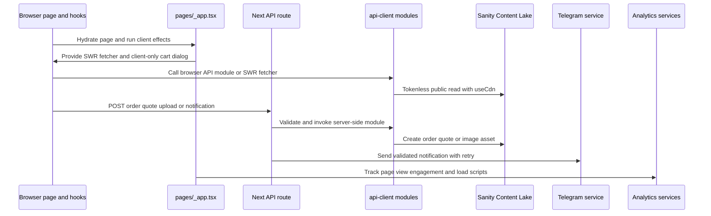

# Runtime Boundaries and Request Architecture

This application is a Next.js **Pages Router** site. A request can be handled during static generation, on the server in `getServerSideProps` or an API route, or in the browser after hydration. The most important boundary is between public, tokenless Sanity reads and server-only Sanity writes: browser-facing modules use `api-client/sanity-browser.ts`, while `api-client/sanity-server.ts` owns the token-bearing client and is reached by API routes.

## Component and request boundary

*The diagram shows the inspected browser, shared-app, API, Content Lake, notification, and analytics boundaries; it does not imply a direct browser connection to privileged Sanity operations.*

### Shared application bootstrap

`pages/_app.tsx` is the client/server page shell. It selects the page's optional `Component.Layout`, falling back to `EmptyLayout`, and mounts the page component inside MUI's `ThemeProvider`, Emotion's `CacheProvider`, and `CssBaseline`. `SWRConfig` supplies a single session-level fetcher, `(url) => axiosClient.get(url)`, enables retry-on-error, and creates a `Map` provider. Consequently, ordinary SWR reads use the shared Axios client unless a hook supplies its own fetcher.

The shell also mounts the cart wrapper, toast renderer, and dialog container. These three are `next/dynamic` imports with `ssr: false`; they are client-only islands rather than SSR output. `ProductCartWrapper` additionally waits for `useEffect` to set `mounted` before rendering, because the persisted cart is browser `localStorage` and would otherwise produce a hydration mismatch. It only exposes the lighter cart on paths beginning `/san-pham/lighters`.

Route effects are deliberately owned by the shell. `useEngagementTracking(router.pathname)` records scroll and time-on-page behavior in the browser. Another effect records the initial page view and subscribes to `routeChangeComplete`, removing the listener on cleanup. Consent mode and bfcache, speculation, and prefetch monitoring are initialized in effects and cleaned up on unmount. Analytics UI/scripts include Vercel `Analytics`, Facebook chat, Google tag/schema components, and the Umami script loaded lazily by `_document.tsx`; these are integrations, not request handlers for business data.

`pages/_document.tsx` is the document-level SSR wrapper: it emits the HTML language, metadata, fonts, scripts, `Main`, and `NextScript`, and uses Emotion server extraction to pass critical style tags to the document. It should not be used for interactive state or browser data fetching.

## Page data: static generation versus SSR

Page modules call API-client functions directly during their server data phase; they do not need to traverse an HTTP API route for public CMS content.

- Static pages such as `pages/index.tsx` use `getStaticProps`. The home page fetches blog content, a banner, and special products in parallel and returns `revalidate: 300`, so its generated props are refreshed on that interval.
- Dynamic CMS pages such as the lighter catalog use `getServerSideProps`. `pages/san-pham/lighters/index.tsx` reads the filter, fetches the first 24 items, types, and banner in parallel, filters drafts, and sets `public, s-maxage=300, stale-while-revalidate=600`.
- Search has both a page-side SSR path and an HTTP API path. Invalid search parameters become a prompt; an unavailable search source becomes a 503 page state in SSR or a 503 JSON response from `/api/search`. Valid API results receive the same shared cache policy.

The catalog's initial server props feed `useInfiniteCatalog` in the browser. An `IntersectionObserver` watches a sentinel with a 600px root margin, serializes one request at a time, appends the next page, and stops when the fetched page is empty or `nextPage * pageSize >= total`. A failed page load is held as local error state and exposed through a retry action; it does not replace the already rendered items. The client loader uses the API-client's bounded page size (1–48) and Sanity queries exclude draft documents.

## Browser API clients and SWR behavior

`api-client/axios-client.ts` is the browser-oriented HTTP client. Its base URL is `/api`, it sets JSON content type, adds non-PII request ID and timestamp headers, and adds `x-api-key` from `envConst`. Successful Axios responses are unwrapped to `response.data`. Errors are normalized into cancellation, HTTP-response, no-response, or setup-error shapes; this makes hook-level failures predictable, but callers still need to present an error state.

Read hooks use either the shared SWR configuration or an explicit fetcher. `useStaticContentBySlug` and `useShippingFees` disable focus revalidation and deduplicate for five minutes; their key is `null` when disabled or missing its input. `useOrderByNumber` also uses a null key until it has a single order number. Mutation hooks use `useSWRMutation` and run only after `trigger`: order creation and the quote form use native `fetch` or API-client modules, while Telegram mutations post through Axios. `useCreateLighterOrder` opts into `throwOnError`, so its submitter must catch a rejected trigger.

One subtle client boundary is that `components/swr` exports a Sanity `fetcher` using the tokenless browser client and a separate `creater` that POSTs to a supplied API key. The generic `SWRConfig` fetcher is Axios instead, so a hook's explicit fetcher determines which behavior applies.

## Zustand and client-only state

The lighters cart is a browser-owned Zustand store exported through `store/index.ts`. It persists items and computed totals under `inut-lighters-cart` using `createJSONStorage(() => localStorage)`, and recalculates totals during rehydration. Adding the same product and lighter type merges quantities and recalculates tiered unit price and subtotal; non-positive quantity removes the item. The layout preference is a separate persisted store under `inut-lighters-layout`, with `grid` as the default and `list` as the alternate.

These stores must not be treated as SSR state. The cart UI waits until mount, and route-aware hooks (`useCurrentCart`, `useCartConfig`, and `useHasCartSupport`) select support from `router.pathname`; currently only the `lighters` category returns a cart store. Other browser-only facilities include engagement and consent persistence. The Axios auth-token lookup is only a commented placeholder, not an implemented authentication boundary.

## Server API routes and privileged integrations

API routes validate method and payload before crossing into server-side services:

- `POST /api/orders/lighters` rate-limits attempts, requires customer fields and structurally valid Sanity references in every order item, then calls `createLighterOrder`. The server client adds `_type: "ordersLighter"`, generates an order number, and creates the document in Sanity with `useCdn: false`.
- `POST /api/quote-request` rate-limits five requests per minute per request token, requires the core quote fields, and creates the `form-nhan-bao-gia` document through the token-bearing server client.
- `POST /api/sanity/upload-image` accepts only PNG, JPEG, WebP, or SVG data, applies a 14 MB parser/input limit and a five-per-minute limiter, then uploads a Buffer as a Sanity image asset. The API route, not the browser bundle, owns the Sanity write token.
- `/api/validate-phone` checks the API key after rate limiting and format validation, then probes Zalo. It is advisory: rate limits, invalid values, and upstream errors return a successful response with `zaloRegistered: null`, so phone checking must never block quote submission. `usePhoneZaloCheck` debounces valid input by 500ms and ignores stale results.
- Telegram notification routes authenticate with `x-api-key`, validate required data and Telegram environment configuration, and call `sendWithRetry`. The order route supports retry count and base delay environment overrides and returns 429, 400, 401, 500, or 200 outcomes as appropriate. The corresponding SWR mutation hooks expose `isSending` and `error` to the form or checkout UI.

The Sanity Studio is a separate Sanity v2 workspace under `sanity/`, configured for project `soud11bs` and the `production` dataset in `sanity/sanity.json`. Its schemas and admin tools are an authoring surface; the Next.js site reads the Content Lake through the public client and writes submitted orders, quotes, and uploaded assets only through server routes. Deployment and dataset changes therefore need coordination between the Studio configuration and the web app's environment variables.

## Failure handling and safe extension points

There is no repository-wide React `ErrorBoundary` component. Failures are handled at the request/domain boundary: API routes return explicit JSON/status codes, Axios normalizes transport failures, SSR search renders an error status, infinite catalog exposes retry, and forms use validation, toasts, and mutation errors. A new page or hook should preserve that pattern rather than assuming an uncaught exception will be converted into a friendly fallback.

When adding a data path, keep the direction explicit: public reads can use `sanity-browser` and should remain tokenless; mutations, uploads, and privileged reads belong behind a `pages/api` route and `sanity-server`. For browser requests, prefer the shared Axios/SWR behavior when its normalized errors and headers are wanted; use an explicit fetcher only when the endpoint contract requires it. For persisted state, render browser-dependent UI after mount and define rehydration behavior, otherwise SSR and client markup can diverge. Finally, preserve rate limiting, method checks, input bounds, and upstream-failure semantics when introducing another external notification or analytics integration.
