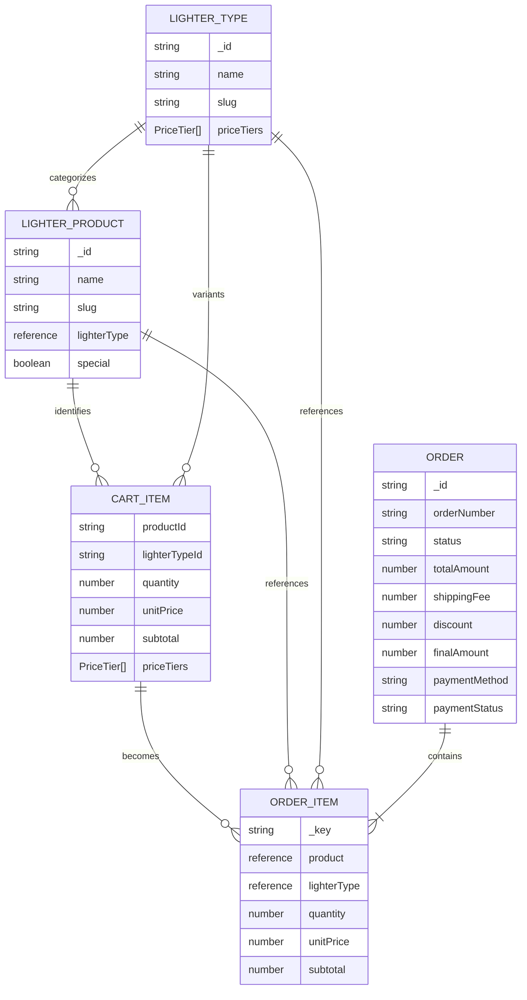

# Catalog, Pricing, Cart, and Order Contracts

This page is the contract map for the lighter commerce path. Sanity is the source of catalog and order documents; the browser reads catalog data and owns a persisted Zustand cart; checkout converts that cart into a validated API payload before the server creates an `ordersLighter` document. The same model file also contains contracts for other product carts, but the detailed pricing and order rules below are for lighters.

## Entity relationships



Caption: The catalog type supplies pricing to product variants, cart items carry a pricing snapshot, and checkout turns each item into a keyed order line with Sanity references.

### Catalog documents

- `lighterType` is the pricing/category document. It requires `name` and `slug`, and contains `priceTiers`, an array of `{ quantity, price }` entries. Each quantity is a minimum quantity for its tier and must be at least 1; each price must be non-negative. Prices are handled as VND numeric amounts by the TypeScript model and calculator. The schema's editor description says “VND (thousands)”, but there is no conversion in the API or calculator, so changing units would be a breaking contract.
- `lighterProducts` is the sellable document. It requires `name`, `slug`, and a reference to one `lighterType`; it may have rich-text `details`, images, and a `special` flag (default `false`). The product does not embed a price: its `lighterType` reference supplies the tiers.
- Catalog reads use Sanity GROQ. `lightersApi.getLightersPage` excludes draft documents, can filter by `lighterType->slug.current`, returns `{ items, total, page, pageSize }`, and caps page size at 48 (default 24). Detail reads can populate `lighterTypeDetails`, including its tiers. The analogous `productsApi` contract applies to regular `products` and `macnut` documents, whose product/type references are separate from the lighter order path.

## Tier pricing and display values

`calculateUnitPrice(priceTiers, quantity)` sorts a copy of the tiers by descending threshold and chooses the first tier where `quantity >= tier.quantity`. Thus the highest applicable threshold wins; a quantity of 7 uses the 5-unit tier, not a prorated or blended price. If the quantity is positive but below every configured threshold, the lowest tier is used as a base-price fallback. Empty tiers or a non-positive quantity log an error and return `0`.

An item's `subtotal` is always `unitPrice * quantity`; the cart total is the sum of item subtotals and `totalItems` is the sum of quantities. `formatPrice` is presentation-only and formats the numeric amount with the `vi-VN` locale and `₫`; `getPriceTierOptions` sorts tiers ascending to present choices. Be careful that `getPriceTierOptions` sorts the supplied array in place, whereas `calculateUnitPrice` does not mutate its input.

The checkout breakdown is:

```text
finalAmount = total + shipping - discount
```

The shared `calculatePriceBreakdown` clamps its returned display `finalAmount` to zero, while the current lighter checkout constructs and persists `finalAmount` directly from `totalAmount + shippingFee - discount`. Therefore, do not treat a displayed breakdown as authoritative order persistence: order creation receives the explicit numeric fields and Sanity stores them. Any manual Sanity edit to `totalAmount`, `shippingFee`, or `discount` requires manually recalculating `finalAmount` to preserve the invariant.

## Cart contract and lifecycle

`CartItemLighter` is a browser-facing snapshot, not a Sanity document. Its identity is the pair `(productId, lighterTypeId)`, with product/type names and image for display, `quantity`, calculated `unitPrice` and `subtotal`, and a copied `priceTiers` array for later recalculation. Optional `designImage`, `designPreview` (URL plus rotation, scale, x, y), and `builderPreviewUrl` preserve custom-builder context.

`useLightersCart` is a Zustand store persisted in `localStorage` under the exact key `inut-lighters-cart`. It persists items and totals, then recalculates totals during rehydration. `addItem` merges an existing identity pair by adding quantities and recalculating the tier price for the new aggregate quantity. `updateQuantity` recalculates the tier price and subtotal; zero or negative quantities remove the item. Remove, clear, and `setItems` also recalculate aggregate totals. The store is therefore the owner of client cart totals, but persisted totals are recoverable derived values rather than an independent pricing authority.

Route selection keeps this cart separate from other commerce carts: paths matching `/san-pham/lighters` map to category `lighters`, order type `ordersLighter`, and `/checkout/lighters`. Do not infer a lighter order from a generic product cart or change the storage key without a migration plan.

## Checkout payload and Sanity order

The checkout page creates one order line per cart item. It generates a unique `_key` from product ID, lighter type ID, time, and array index; supplies `product: { _ref: productId, _type: "reference" }` and `lighterType: { _ref: lighterTypeId, _type: "reference" }`; and copies names, quantity, unit price, subtotal, and design metadata. `_key` is mandatory for every Sanity array item, and both references must point to the intended current documents. Design upload failures are non-fatal: checkout logs the error and continues without the uploaded design fields.

The `CreateOrderLighterInput` omits the server-owned `_type`, `orderNumber`, and normally `orderDate` (an optional caller-supplied date remains possible). The checkout starts orders with `status: "pending"`, `paymentStatus: "pending"`, the selected shipping fee, a zero discount, and the computed final amount; payment method is either `cod` or `bank_transfer`. Customer name and phone are required; email, address, notes, and design fields are optional.

The browser sends the payload with `POST /api/orders/lighters`. The API allows only POST, rate-limits attempts to 10 per minute per request token, checks customer name/phone and that `orderItems` is an array, then rejects any line missing `_key`, `product._ref`, or `lighterType._ref`. It does not recalculate prices or totals, so clients and future server hardening must treat the payload's monetary values as a trust boundary. Successful creation calls the server Sanity client with `useCdn: false`, adds `_type: "ordersLighter"`, generates a `LIGHTER-...` order number, defaults `orderDate` to the current ISO timestamp, and creates the document.

## Persisted order fields and lifecycle

An `ordersLighter` document records customer and delivery information, the keyed `orderItems` array, `totalAmount`, `shippingFee`, `discount`, and `finalAmount`, plus optional `notes`, `adminNotes`, and `trackingNumber`. Its order status values are `pending`, `confirmed`, `processing`, `in_transit`, `completed`, and `cancelled`. Payment method values are `cod` and `bank_transfer`; payment status values are `pending`, `paid`, `failed`, and `refunded`. The schema defaults order status to `pending`, payment status to `pending`, payment method to `bank_transfer`, and shipping/discount to zero. For COD, the Studio payment-status field is hidden, although the data contract still permits the status values.

Order retrieval queries by exact `orderNumber` and expands product and lighter-type references for tracking views, including current catalog names, images, and price tiers. This is a read projection, not a rewrite of the historical `productName`, `lighterTypeName`, `unitPrice`, or `subtotal` captured on the order line. Preserve both references and snapshots: references support navigation and integrity, while snapshots explain what was ordered if catalog presentation changes.

## Safe change checklist

When changing this model, verify the whole boundary rather than only one type:

1. Update the Sanity schema, TypeScript types, GROQ projections, checkout mapping, API validation, and order read projection together.
2. Keep tier thresholds positive, prices non-negative, quantities positive, and all monetary values in the same VND unit; test boundary quantities immediately below, at, and above each tier.
3. Assert `subtotal = unitPrice * quantity`, cart totals as sums, and `finalAmount = total + shipping - discount` (including the display clamp behavior when using `calculatePriceBreakdown`).
4. Test cart merge/update/remove and localStorage rehydration under `inut-lighters-cart`.
5. Test that every submitted order line has a unique `_key` and valid product/type reference shape, that malformed requests return 400, rate limits return 429, and Sanity creation returns a generated `LIGHTER-` number.
6. Treat order status/payment status transitions and design-preview fields as operational contracts; changing them requires updating Studio options, tracking reads, notifications, and any downstream workflow.

## Related pages

- [Runtime boundaries](/openwiki/architecture/runtime-boundaries.md)
- [Sanity CMS integration](/openwiki/integrations/sanity-cms.md)
- [Cart to order workflow](/openwiki/workflows/cart-to-order.md)
