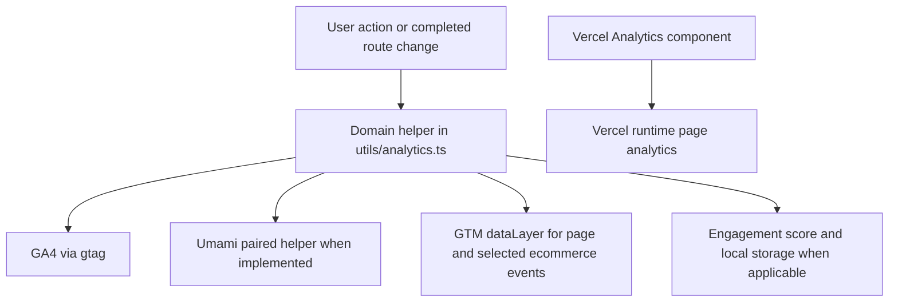

# Analytics, Consent, SEO, and Performance Surfaces

This application has three related but separate surfaces:

- **Runtime analytics:** client-side actions are routed through `utils/analytics.ts` to GA4 (`gtag`), and—where the helper provides a paired implementation—to Umami. Selected commerce and page-view events are also pushed to the GTM `dataLayer`; `@vercel/analytics/react` is mounted globally in `pages/_app.tsx`.
- **Consent:** Google Consent Mode v2 defaults storage to privacy-first denied values and restores a saved decision from `localStorage`.
- **SEO and performance:** `next-sitemap` generates `sitemap.xml` and `robots.txt` after a build; separate browser monitors measure BFCache, speculation-rule support, prerender activation, and fallback prefetch behavior.

Do not use a successful analytics request as evidence that SEO metadata or indexing configuration is correct. The SEO smoke test reads generated files on disk, while runtime telemetry is observed in the browser and analytics consoles.

## Runtime event fan-out

Call tracking at the action source—such as an `onClick`, `onSubmit`, or the route-change callback—not from a render or an effect whose only purpose is to mirror state. This keeps one user action from becoming duplicate events during React rerenders. The existing route-view effect is the deliberate lifecycle exception: it sends the initial route once and subscribes to `routeChangeComplete`, removing the listener on cleanup.



*The fan-out shows the supported gateways; not every low-level `trackEvent` call has a paired Umami or dataLayer call.*

`pages/_app.tsx` calls `trackPageView(router.pathname)` for the initial load, then tracks each `routeChangeComplete` URL and unregisters the handler when the effect is replaced. `trackPageView` emits GA4 `page_view`, a custom Umami page view with URL/title, and a dataLayer `page_view` enriched with `user_type`, `device_type`, `traffic_source`, and a session ID. `Analytics mode="production"` is rendered once at the application root for Vercel Analytics.

### Gateways and event vocabulary

`gtag` is a guarded wrapper: it calls `window.gtag` when available and otherwise prints `[GA Debug]` in development. Umami is enabled only when `window.umami` exists and `NEXT_PUBLIC_ENABLE_UMAMI === "true"`; unavailable integrations similarly produce development diagnostics rather than throwing. Production GA4 and GTM scripts are rendered only by `GoogleTagSchema`, and only when their respective IDs are present. Their `lazyOnload` scripts initialize `dataLayer`, configure GA4 with the initial `page_path`, and load GTM.

Use the paired domain helpers for the critical funnel events:

- Commerce: `view_item`, `select_item`, `add_to_cart`, `remove_from_cart`, `begin_checkout`, and `purchase`.
- Conversion: `order_button_click`, `contact_click`, `form_submit`, `phone_click`, `zalo_click`, and `social_click`.
- Engagement/navigation: `page_view`, `search`, `file_download`, `outbound_click`, video events, `time_on_page`, `search_open`, `search_result_click`, and `catalog_pagination`.
- Performance: `bfcache_status`, `bfcache_not_restored`, `speculation_support`, `prerender_activated`, and `prefetch_effectiveness`.

The gateway rule is important when extending tracking: a helper that calls only `trackEvent` is GA4-only. Add the corresponding `trackUmamiEvent` or specialized Umami helper when the event is intended to be dual-tracked. Similarly, add `pushCustomEvent` or `pushEcommerceEvent` when GTM consumption is part of the requirement. GA4 commerce payloads use `currency: "VND"`; product items carry IDs, names, category/variant, price, and quantity. `purchase` additionally carries the transaction ID and order value.

The dataLayer utility initializes `window.dataLayer` lazily, pushes `{ event, ... }` records, and provides test-oriented inspection helpers (`getDataLayer`, `hasEventInDataLayer`, and `getLastEvent`). It also derives device buckets (`mobile` below 768px, `tablet` below 1024px), price bands (`budget`, `mid-range`, `premium`), visit-based user type, UTM/referrer traffic source, and a session/page-depth value. Treat those derived dimensions as client heuristics, not authoritative customer identity.

## Engagement and lifecycle behavior

`useEngagementTracking(router.pathname)` owns per-route behavioral instrumentation. It starts a timer on mount, attaches a passive scroll listener, and removes both on cleanup. It records only the highest unreached milestone from 25%, 50%, 75%, and 100%; in the current implementation only the 100% milestone is sent to GA4 as `scroll_depth`. On route unmount it sends `time_on_page` with whole elapsed seconds. The Umami time-on-page and scroll calls are currently commented out, so do not assume those two events are dual-tracked.

The engagement scorer is a separate local model. It retains at most the latest 100 events in `localStorage`, recalculates a decayed score, and pushes `engagement_event` to the dataLayer. Default weights make purchase (50), contact (15), add-to-cart (10), search (5), click (3), scroll (2), and page view (1) materially different; the default decay factor is `0.95` per day and the session timeout setting is 30 minutes. Storage failures are logged and return safe empty/zero values. This score is useful for segmentation (`new` through `champion`) but is not a replacement for GA4/Umami event delivery.

## Consent ordering and persistence

`initializeConsentMode()` is mounted from `_app.tsx` before the application’s analytics scripts are intended to load. It sends `gtag("consent", "default", ...)` with analytics and advertising storage denied, functionality and security granted, and `wait_for_update: 500`; if a saved decision exists, it immediately sends `consent update`. Preferences are stored under `inut_consent_preferences` with a timestamp.

Consent controls include `grantAllConsent`, `denyAllConsent`, and `grantAnalyticsConsent`. `updateConsent` updates Google, persists the settings, and pushes `consent_update` to the dataLayer. `hasAnalyticsConsent` and `hasAdConsent` inspect the saved decision, while `needsConsentRenewal` returns true when no decision exists or it is at least 365 days old. If `window.gtag` is unavailable, initialization/update warns and does not persist or push the update; deployment changes must therefore preserve the script and initialization ordering rather than relying on later rerenders.

## BFCache, speculation, and prefetch instrumentation

The root app initializes the three monitors once and cleans up their listeners on unmount:

- **BFCache:** `initBFCacheMonitoring` listens for `pageshow`. It records whether `event.persisted` restored the page, navigation type, path, and `performance.now()` restoration timing as `bfcache_status`. When available, `notRestoredReasons` is recursively flattened and sent as `bfcache_not_restored`. A persisted restoration also re-sends the Umami page view so restored visits are visible there.
- **Speculation:** `SpeculationRulesScript` detects support and injects serialized rules for the current path. Critical routes are prefetched at moderate eagerness, secondary routes conservatively, product/service/blog links through document rules, and `/` is the only baseline prerender target. Product and service contexts add rules; checkout, API, Sanity, and order-tracking patterns are excluded. The monitor records browser support and prerender activation time, including `prerenderingchange`.
- **Fallback prefetch:** browsers without `HTMLScriptElement.supports("speculationrules")` receive `<link rel="prefetch" as="document">` links for critical plus selected secondary routes. Hover prefetch waits 100 ms, skips external/hash/already-prefetched links, and returns cleanup that removes listeners and generated links. Duplicate prefetch links are avoided.

The performance helpers in `utils/analytics.ts` expose GA-shaped event names, while the dedicated Umami performance helpers exist separately. When adding a new performance signal, decide explicitly whether it belongs on both gateways and keep the event parameters stable (`*_time_ms`, support booleans, URL/path, and reason counts).

## SEO generation and verification

The `postbuild` script runs:

```bash
next-sitemap --config next-sitemap.config.js && node scripts/verify-seo.mjs
```

`next-sitemap.config.js` uses `NEXT_PUBLIC_SITE_URL` or `https://inutdesign.com`, disables an index sitemap, excludes `/search`, and generates robots rules that allow `/`, point `Host` and `Sitemap` at the site URL, and disallow query-update URLs, signup, image/build internals, and well-known app metadata paths. Explicit crawler policies allow the listed AI crawlers and give Mediapartners-Google search access.

`scripts/verify-seo.mjs` is a build artifact smoke test, not a browser test. It fails when `public/robots.txt` or `public/sitemap.xml` is absent; checks robots directives and canonical host/sitemap strings; requires at least one sitemap URL; rejects `/search` and all query-parameter URLs; and requires the home, blog, contact, product, laptop, keyboard-skin, and services URLs. Run it after generation (normally through `pnpm build`); if a route is intentionally added or removed, update the sitemap configuration and the expected URL list together.

## Configuration and focused verification

Configure `NEXT_PUBLIC_GA_MEASUREMENT_ID`, `NEXT_PUBLIC_GTM_ID`, `NEXT_PUBLIC_ENABLE_UMAMI`, `NEXT_PUBLIC_UMAMI_WEBSITE_ID`, and optionally `NEXT_PUBLIC_UMAMI_HOST_URL` (default `https://cloud.umami.is`). In development, use `[GA Debug]`, `[Umami Debug]`, and `[DataLayer]` logs plus `getDataLayer()` to verify calls. In production, inspect GA4/GTM network requests and Realtime/Tag Assistant, Umami requests, and Vercel Analytics. Check one route transition, one product view/add-to-cart/purchase path, and one consent grant/deny path rather than relying only on page-load inspection.

For changes to this surface, the focused checks are: run `pnpm build` to exercise `postbuild` SEO generation and verification; use the tracking validation script to confirm required environment keys, dataLayer integration, duplicate-call warnings, and Umami/consent recommendations; and test monitor cleanup/support branches in a browser that supports speculation rules and one that does not. Pay special attention to initial page views, route changes, BFCache restores, and React Strict Mode/development reruns, where duplicate subscriptions or action calls are easiest to introduce.
