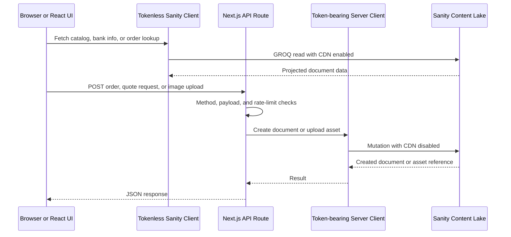
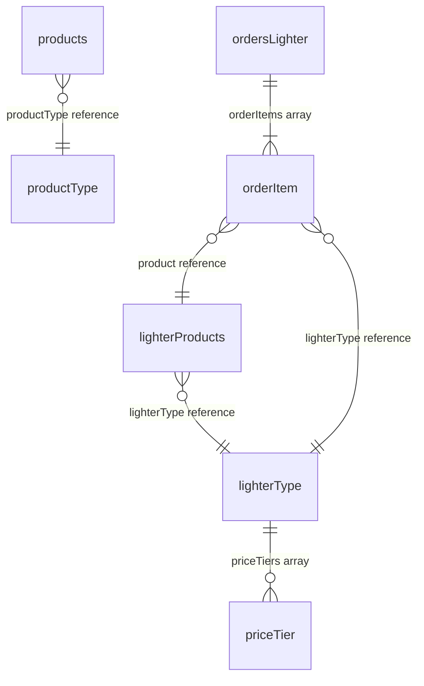

# Sanity CMS Integration and Content Contracts

Sanity is the headless CMS for the INUT Design storefront. The Sanity v2 Studio is configured in `/sanity`, while the Next.js application uses the Sanity client modules under `/api-client`. The Studio project is `INUT`; the checked-in Studio configuration targets the `production` dataset, and the public application client obtains its project and dataset from `NEXT_PUBLIC_SANITY_PROJECT_ID` and `NEXT_PUBLIC_SANITY_DATASET`.

The important boundary is intentional: browser-importable modules contain only tokenless, CDN-backed reads; all mutations and asset uploads go through Next.js API routes and the token-bearing server client. Do not import the server client into React/browser code or expose `SANITY_TOKEN` to `NEXT_PUBLIC_*` configuration.

## Runtime and access boundary

This diagram shows the enforced application-level separation between public reads and privileged writes.

`sanity-browser.ts` creates a client with the public environment variables, API version `2022-09-19`, and `useCdn: true`; it also provides the image URL builder. `sanity-client.ts` is only a backward-compatible re-export of that tokenless entry point. `sanity-server.ts` selects `SANITY_PROJECT_ID`/`SANITY_DATASET` first (falling back to the public values), uses `SANITY_TOKEN`, and sets `useCdn: false` for writes. The server module owns lighter-order creation, status patches, and asset uploads.

## Studio configuration and schema registry

The Studio is Sanity v2 (`@sanity/*` dependencies at 2.33.2), launched with `pnpm start`, built with `pnpm build`, and deployed with `sanity deploy`. `/sanity/sanity.json` registers the project and dataset, enables the default Studio plugins plus media, and enables Vision in development. To work against development data, change `api.dataset` in that file to `dev`; treat `production` as live data and verify the selected dataset before editing or deploying.

`sanity/schemas/schema.js` is the registry. It concatenates the plugin types with the business/content types: `ordersLighter`, `form-nhan-bao-gia`, `bankInfo`, `shippingFee`, `lighterProducts`, `lighterType`, `products`, `productType`, `macnut`, `macnutType`, `staticContentEachPage`, `banner`, and `blockContent`. A new document type is not part of the contract until it is imported and added to this registry.

The key catalog relationships are:

The diagram shows document references and nested objects; Sanity stores references as `_ref` values and does not automatically give the application the denormalized fields it expects unless GROQ explicitly dereferences them.

### Catalog documents

- `products` represents laptop-skin products. `name` and `slug` are required, `image` is an image array with hotspot support, `details` is a string, `special` defaults to false, and `productType` is a required reference to `productType`.
- `lighterProducts` represents lighter products. Its required `lighterType` reference points to `lighterType`; `details` is `blockContent`, and `special` defaults to false.
- `lighterType` is the pricing/category document. Its required `name` and `slug` accompany optional rich-text `description` and `priceTiers`. Each tier requires `quantity >= 1` and `price >= 0`; the schema describes price as VND thousands per unit, while order fields store VND.
- The registry also contains parallel `macnut`/`macnutType` types and other editable marketing/content documents. Preserve their registered names when adding or migrating content because GROQ filters use `_type` strings.

Catalog reads in `productsApi` and `lightersApi` use explicit projections rather than returning entire documents. List queries include at most two images, identity/name/slug, category reference, flags, and creation time; detail queries add details, full images, update metadata, and revision where applicable. Pagination clamps page numbers to at least 1 and page sizes to 1–48 (default 24). Product and lighter pages run item and `count(...)` queries in parallel, order by `_createdAt desc`, exclude draft IDs, and filter through the referenced type slug. Search input is trimmed, wildcard characters are neutralized, and limited to 80 characters.

When a caller needs pricing/category data, `getLighterWithTypeBySlug` explicitly uses `lighterType->{...}`. Keep projections minimal and keep image fields `_key, _type, asset, crop, hotspot`: image arrays and nested Sanity arrays require stable `_key` values for rendering and mutation integrity. If a projection omits `_key`, consumers that reconcile array items can lose identity.

## Orders and quote requests as content contracts

### Lighter orders

`POST /api/orders/lighters` is the write entry point. It accepts only POST, applies a rate limit of 10 attempts per minute per request token, requires customer name/phone and an array of items, and rejects any item lacking `_key`, `product._ref`, or `lighterType._ref`. It then calls `createLighterOrder`, which adds `_type: "ordersLighter"`, generates a `LIGHTER-` order number from local date-time plus a random digit, and supplies the current timestamp when `orderDate` is absent. A Sanity create mutation persists the result; failures are logged server-side and returned as a generic 500 response.

The `ordersLighter` schema requires at least one order item. Each item carries references to `lighterProducts` and `lighterType`, quantity at least 1, non-negative `unitPrice` and `subtotal`, and optional design asset/preview fields (`designImage`, `designPreview`, `builderPreviewUrl`, and `designSourceUrl`). The order also records customer/delivery data, payment method, amounts, notes, tracking, and admin notes. Status defaults to `pending` and is constrained in the Studio to `pending`, `confirmed`, `processing`, `in_transit`, `completed`, or `cancelled`. Payment status defaults to `pending` and is hidden for COD orders. `finalAmount` is not calculated by the schema or mutation: the schema explicitly tells an administrator to recalculate it after changing total, shipping, or discount.

`updateOrderStatus` patches only `status`. `getOrderByNumber` is a tokenless public read and returns a deliberately explicit order projection, including `_key` for each item and dereferenced product/type details. Keep the stored references and the denormalized-looking fields expected by the projection aligned when changing the order payload; a missing reference causes the API route to reject the order, while a deleted target can make dereferenced data null.

### Quote requests

`POST /api/quote-request` accepts only POST, allows five attempts per minute per request token, and requires `customerName`, `phone`, and `usagePurpose`. The route constructs a `form-nhan-bao-gia` document and sets `createdAt` at write time before calling the server client. The schema validates customer name, phone shape/length, usage purpose, and receive-quote channel; conditional detail fields appear only for `other`, and `urgentDate` appears only when priority is `gap`. The form contains optional company, email, quantity, device, design, notes, and urgency information.

The editable `createdAt` field is distinct from Sanity system `_createdAt`. Existing records created before that field was introduced require the documented migration script; run its dry run before applying changes. The Studio provides ordering by the editable submission time and customer name. Operational reports read both quote and lighter-order document types and interpret date ranges in `Asia/Ho_Chi_Minh`.

## Images and payment content

Browser-side `uploadImageToSanity` validates PNG, JPEG, WebP, and SVG, rejects files over 10 MB, preserves SVG, and rasterizes oversized raster images to WebP at a maximum 2048-pixel dimension before base64 encoding. It sends JSON to `/api/sanity/upload-image`; the browser never receives a Sanity write token.

The upload route accepts POST only, rate-limits to five attempts per minute, has a 14 MB JSON body-parser limit, validates the declared image type and encoded data length, then decodes base64 and delegates to `serverClient.assets.upload("image", ...)`. It returns an image value containing `_type: "image"` and an asset reference `{ _ref, _type: "reference" }`, suitable for embedding as `designImage`. Base64 size and decoded file size are not identical, so keep both the client’s 10 MB source limit and the route’s 14 MB transport guard in mind.

`bankInfo` documents are public payment-display content. Required fields identify the bank, account, and holder; `isActive` controls whether an account is shown, `isPrimary` controls priority, and `displayOrder` controls ordering. `bankInfoApi.getActiveBankAccounts` filters active documents and orders primary first then display order; `getPrimaryBankAccount` returns the first active primary account. The API projection includes account number and QR/logo asset, so restrict access to these read helpers and do not put internal notes or bank data into unrelated public payloads.

## Safe change and operations checklist

1. Select the intended dataset in both Studio configuration and application environment variables; never test mutations against production by accident.
2. For a schema change, update the schema file, register it in `schemas/schema.js`, then update every GROQ projection and TypeScript model that consumes it.
3. Preserve `_type`, slug shapes (`slug.current`), reference fields (`_ref`), image asset shapes, and `_key` values in order arrays. Update both the stored mutation payload and dereferencing projections together.
4. Keep reads in `sanity-browser.ts`/the explicit read APIs. Keep `SANITY_TOKEN`, `create`, `patch`, and `assets.upload` in server-only modules and API routes.
5. Validate order and upload routes with malformed payloads, missing `_key`/references, wrong methods, rate-limit exhaustion, oversized/unsupported images, and Sanity failures. Validate quote conditional fields and the `finalAmount` manual-recalculation behavior in Studio.
6. For operational reporting, use `sanity/scripts/report.mjs`; for old quote records, use the `createdAt` backfill script with `DRY_RUN` first. Studio deployment is `sanity login` followed by `sanity deploy`.

## Related pages

- [Catalog and content model](/openwiki/concepts/catalog-and-content-model.md)
- [Development and deployment](/openwiki/operations/development-and-deployment.md)
- [Cart to order](/openwiki/workflows/cart-to-order.md)
- [Quote request](/openwiki/workflows/quote-request.md)
