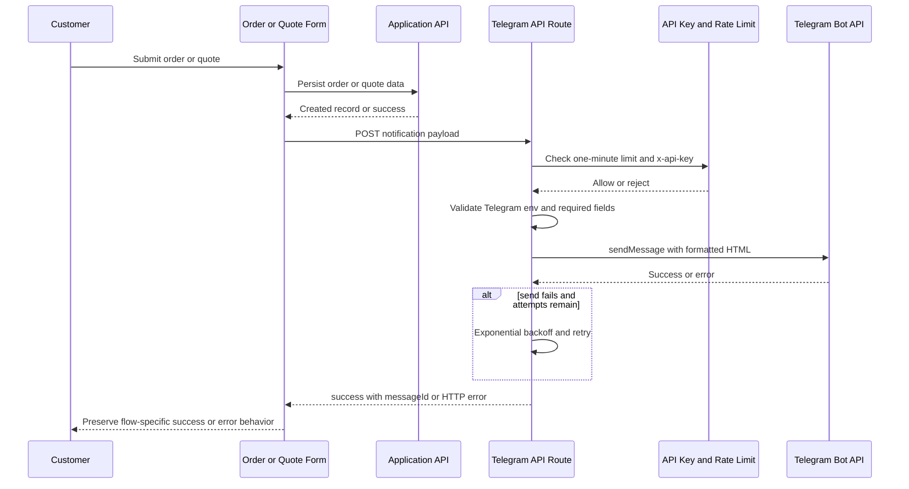
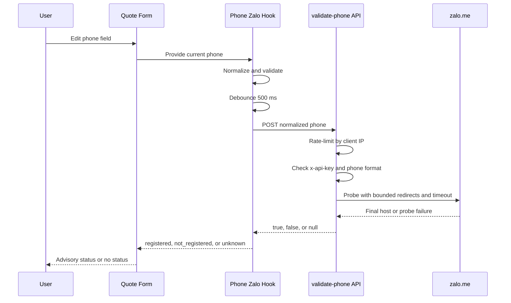

# Telegram Notifications and Zalo Phone Advisory

This integration has two separate responsibilities:

- **Telegram** sends operational messages to one configured bot chat when an order is created, a quote request is submitted, or a checkout is abandoned.
- **Zalo** performs an advisory phone-number probe while a quote form is being filled. It can show `registered`, `not_registered`, or `unknown`, but it must never prevent the quote from being submitted.

No Telegram bot token, chat ID, or API key belongs in this page. Configure them through deployment environment variables.

## Telegram configuration and trust boundary

The client-side API wrapper uses `/api` as its base URL and adds `x-api-key` from `NEXT_PUBLIC_X_API_KEY` to Axios requests. The abandoned-checkout `keepalive` path does the same explicitly because it uses `fetch` rather than Axios. Each Telegram route compares that header with `envConst.X_API_KEY`; a mismatch returns `401 Unauthorized`.

Telegram itself is configured with:

| Variable | Purpose | Validation |
| --- | --- | --- |
| `NEXT_PUBLIC_TELEGRAM_BOT_TOKEN` | Bot token used to construct `https://api.telegram.org/bot{token}` | Required and must match the basic `digits:35-character-token` pattern |
| `NEXT_PUBLIC_TELEGRAM_CHAT_ID` | Destination chat | Required and must contain only digits, with an optional leading `-` |
| `NEXT_PUBLIC_X_API_KEY` | Application-level API-route gate | Compared exactly with the incoming `x-api-key` |
| `TELEGRAM_MAX_RETRIES` | Maximum send attempts | Optional numeric override; default `3` |
| `TELEGRAM_RETRY_BASE_DELAY` | Initial retry delay in milliseconds | Optional numeric override; default `1000` |

The repository names the Telegram variables with `NEXT_PUBLIC_`, so operators should treat the token as sensitive despite that naming convention and avoid exposing it to browser code. `validateTelegramEnv()` runs after method and API-key checks and before any Telegram client is created. Missing or malformed Telegram configuration produces HTTP `500` with a configuration error.

## Routes, limits, and response semantics

All three Telegram endpoints accept `POST` only. They apply their in-memory `rateLimit` check before method and API-key validation, using a one-minute cache with capacity for 500 unique tokens:

| Route | Limit token | Configured limit | Required payload shape |
| --- | --- | ---: | --- |
| `/api/telegram/send-order-notification` | `CACHE_TOKEN` | 10 per minute | `orderData`, including order number/date, customer fields, items, totals, and payment data |
| `/api/telegram/send-quote-notification` | `CACHE_TOKEN` | 10 per minute | `quoteData`, including `customerName`, `phone`, and `usagePurpose` |
| `/api/telegram/send-abandoned-checkout-notification` | `CACHE_TOKEN` | 20 per minute | `customerPhone`, non-empty `orderItems`, and `abandonedAt` |

The shared limiter is process-local (an `LRUCache` with a 60-second TTL), and these routes use the same literal token, so the effective counter is shared within a running process rather than being per customer or per IP. A rejected Telegram request returns `429`. Non-`POST` requests return `405`, and a missing or incorrect API key returns `401`.

After validation, a route formats its payload, calls `sendWithRetry`, and returns `200` with `{ success: true, messageId }` only when Telegram reports success. A Telegram/API or unexpected server failure is logged and returned as `500` with `success: false` and an error. Missing required payload fields return `400` before the external call.

## Formatting, transport, and retry behavior

`TelegramClient.sendMessage()` calls Telegram `sendMessage` with the configured chat ID, HTML parse mode by default, and the message text. The routes explicitly use HTML and disable web-page previews. Telegram responses with `ok` produce the returned `message_id`; unsuccessful responses and Axios failures are converted into `{ success: false, error }`, with detailed server-side logging. A chat migration response logs the suggested replacement chat ID but does not silently change configuration.

`sendWithRetry` retries any unsuccessful `sendMessage` result, not just a selected HTTP status. It makes at most `maxRetries` attempts (the default is three), waiting `baseDelayMs × 2^(attempt - 1)` between attempts. The final result preserves the last error and attempt count. Retry controls are read independently by every route, so changing the environment changes order, quote, and abandoned-checkout sends alike.

The message variants are intentionally different:

- **Order:** `formatOrderMessage` renders the order number and Vietnam-localized time, customer contact/address, item lines, totals, payment method, notes, and links to Sanity Studio and order tracking. User text is HTML-escaped in the order formatter.
- **Quote:** `formatQuoteRequestMessage` maps known purpose, delivery-channel, design-status, and priority values to Vietnamese labels, includes optional company/email/quantity/model/design/urgent-date/notes fields, and timestamps in `Asia/Ho_Chi_Minh`.
- **Abandoned checkout:** `formatAbandonedCheckoutMessage` renders the phone, address, abandonment time, item lines, subtotal, item-line count, and the checkout URL derived from `pagePath` (or `/checkout/lighters`). Its free-text values are HTML-escaped.

## Order and quote runtime paths

The checkout creates the order first. Only after `createOrder` succeeds does it call `useTelegramNotification().sendNotification`; the order flow then tracks the purchase, marks the order complete, clears the cart, shows success, and redirects. Therefore a Telegram failure is caught by the checkout's outer handler and currently surfaces the generic checkout error even though the order may already exist. In contrast, quote persistence and success UI happen before the Telegram call; a quote-notification failure is logged and explicitly does not fail the completed quote flow.

*This sequence shows the shared notification path; order and quote forms deliberately handle the final notification result differently.*

The hooks are SWR mutations over the corresponding `/api/telegram/...` endpoints. `useTelegramAbandonedCheckoutNotification` additionally exposes `sendNotificationKeepAlive`, which posts `/api/telegram/send-abandoned-checkout-notification` with browser `keepalive: true` for page-unload delivery.

## Abandoned checkout lifecycle

The lighters checkout registers `beforeunload` and Next.js `routeChangeStart` handlers. It sends at most one abandoned notification per mounted tracking effect, and only when the cart is non-empty, the phone is exactly ten digits, the order has not been submitted, and the order is not complete. A `beforeunload` uses the fire-and-forget keepalive request; a route change uses the SWR mutation and logs a rejection. The payload includes the current cart items, total, phone, optional address, timestamp, and current route.

This is operational telemetry, not an order record: it does not create an order or block navigation. The route still requires the application API key and required abandoned-checkout fields, so a browser send is best-effort and can be rejected by rate limiting, configuration, or network shutdown.

## Zalo phone advisory

`usePhoneZaloCheck(phone)` is used by the quote form. On every phone change it resets to `idle`, normalizes spaces, punctuation, and a `+84` prefix, and stops unless the result is a valid Vietnamese mobile number or Zalo checking is disabled. For a valid enabled number it waits 500 ms, then posts `{ phone: normalized }` to `/validate-phone`. A ref prevents a response for an older phone value from overwriting the current status. Successful responses map `true` to `registered`, `false` to `not_registered`, and `null` to `unknown`; request errors also become `unknown`.

`isZaloPhoneCheckEnabled()` treats every value except the case-insensitive string `"false"` as enabled. Thus the example environment sets the opt-out explicitly with `ENABLE_ZALO_PHONE_CHECK=false`; an unset value does not disable the probe.

*This sequence shows the optional advisory probe and its graceful unknown result.*

The `/api/validate-phone` route has a one-minute, per-client-IP limit of 20 checks using the first `x-forwarded-for` address or socket address. It deliberately returns HTTP `200` with `zaloRegistered: null` when that limit is exceeded, when the phone is malformed or not a string, or when the Zalo probe fails. Wrong methods return `405`; an API-key mismatch returns `401`. The rate-limit check occurs before method and authentication checks, so even rejected requests consume the local counter.

The probe itself calls `https://zalo.me/{encoded phone}` with a mobile user agent, manually follows up to five HTTP redirects, rejects non-HTTP(S) redirect targets, and aborts each attempt after 10 seconds. It classifies a final host of `zalo.me` as registered, an Apple App Store host as not registered, and every other or malformed result as unknown. It makes one retry when the first probe returns unknown, then returns `null` if uncertainty remains.

Most importantly, Zalo status is never submission-blocking. The quote form may show a confirmation dialog when the user selected Zalo as the quote channel and the feature is enabled, but that dialog is a reminder to allow messages from strangers in Zalo, not a registration gate. After confirmation (or whenever the channel is not Zalo, the feature is disabled, or the advisory request is unknown), the normal quote submission proceeds. Quote persistence and the success message do not depend on the probe result.

## Safe operations and changes

1. Set the Telegram variables and `NEXT_PUBLIC_X_API_KEY` in the deployment environment; never commit real values or paste them into logs or documentation.
2. Validate bot token and chat ID configuration before testing routes. A valid shape does not prove that the bot can access the target chat; Telegram's response is the final connectivity check.
3. When changing notification content, preserve HTML escaping for user-controlled values and keep the message's `Asia/Ho_Chi_Minh` presentation consistent.
4. When tuning retries, remember that each retry is another Telegram request and that the route's rate limit is checked once per incoming API request, not once per retry.
5. Keep Zalo failures nullable and non-blocking. Changes to classification, timeout, or redirect handling must retain the `unknown` path rather than turning network uncertainty into `not_registered`.
6. Focused verification should cover `validateTelegramEnv` token/chat validation, `sendWithRetry` success-after-failure and exhausted-backoff behavior, each route's `401`/`405`/`429`/`400`/`500` responses, formatter escaping and optional fields, and Zalo probe timeout/redirect classification plus the hook's stale-response protection. No repository-specific tests for these integrations were found, so these are the highest-value seams to add or exercise when modifying them.

## Source map

- Routes: `pages/api/telegram/send-order-notification.ts`, `pages/api/telegram/send-quote-notification.ts`, `pages/api/telegram/send-abandoned-checkout-notification.ts`, `pages/api/validate-phone.ts`
- Shared Telegram client, retry, and types: `utils/telegram/index.ts`, `utils/telegram/validateTelegramEnv.ts`, `utils/telegram/telegram.types.ts`
- Formatters: `utils/telegram/formatQuoteRequestMessage.ts`, `utils/telegram/formatAbandonedCheckoutMessage.ts`
- Client hooks and callers: `hooks/useTelegramNotification.ts`, `hooks/useTelegramQuoteNotification.ts`, `hooks/useTelegramAbandonedCheckoutNotification.ts`, `hooks/usePhoneZaloCheck.ts`, `pages/checkout/lighters.tsx`, `components/contact/QuoteRequestForm.tsx`
- Zalo probe and configuration: `utils/zalo/index.ts`, `utils/env-const.ts`, `.env.example`
- Shared request plumbing and limiter: `api-client/axios-client.ts`, `utils/rateLimit.ts`, `utils/phone.ts`
