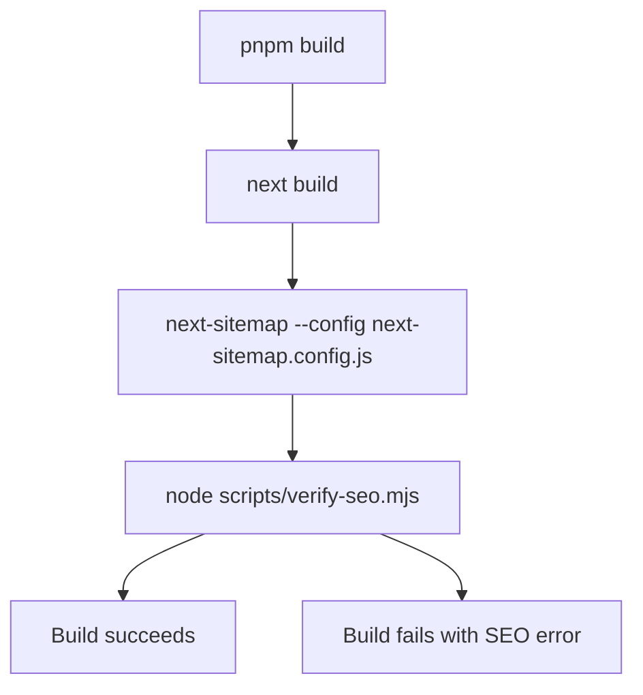

# Configuration, Local Development, and Deployment

This repository contains two independently installed and deployed applications:

- the root Next.js webapp (`inutdesign-web`), served locally on port 3000 and deployed through Vercel; and
- the Sanity v2 Studio under `sanity/`, served locally on port 3333 and deployed to Sanity.

They share the Sanity project, but they do not share an installation directory or deployment command. Keep the root `pnpm-lock.yaml` and `sanity/pnpm-lock.yaml` aligned with their respective `package.json` files.

## Runtime and package-manager prerequisites

Use Node 22. The repository pins `22` in `.nvmrc`; the root package accepts Node `>=20.0.0 <26.0.0`, while the Studio requires Node `^22`. The root package declares `pnpm@10.32.1` as its package manager. The README's broad `pnpm 9+` prerequisite is therefore less precise than the package metadata; use the declared pnpm version where possible.

```bash
nvm use 22
```

Do not replace the pnpm workflows with npm for project dependencies. The Studio's Sanity CLI is a separate global tool and is installed with npm only when needed.

## Environment configuration and secret boundaries

Copy the root `.env.example` to a local root `.env` and fill in the values appropriate to the environment. Never commit `.env`, print its contents, or paste tokens into documentation, logs, screenshots, or issue reports. The template names the integrations and switches currently consumed by the app, including Sanity, analytics, Facebook, Telegram, X, the site URL, Umami, and Zalo validation.

Environment names beginning with `NEXT_PUBLIC_` are intended by Next.js to be available to browser code. Treat their values as public: use them only for non-secret identifiers, URLs, feature flags, and other data that may safely be embedded in the bundle. In particular, do not expose a Sanity write token or bot credential as a public variable. The browser Sanity client is deliberately tokenless and uses `NEXT_PUBLIC_SANITY_PROJECT_ID` and `NEXT_PUBLIC_SANITY_DATASET` with CDN reads. The server client uses `SANITY_TOKEN`, prefers server-side `SANITY_PROJECT_ID` and `SANITY_DATASET` when present, disables the CDN, and owns writes, patches, and asset uploads. Keep that module out of React/browser imports.

The Telegram API route is also a server boundary: it accepts only `POST`, rate-limits requests, checks the `x-api-key`, validates its Telegram configuration, and returns configuration or delivery failures rather than silently succeeding. Review the current environment-variable consumers before renaming variables. Some existing integration names are public-prefixed in the shared environment object even though the route consumes them server-side; do not assume that naming makes a credential safe to expose. A safe migration must update the route, validation, callers, and deployment settings together.

For Sanity's reporting and migration utilities, create `sanity/.env` locally with the required read token. Keep that file private and use a dry run before applying a migration. The Studio project configuration currently points at project `soud11bs` and dataset `production`; switching to `dev` is an explicit edit to `sanity/sanity.json`, not an automatic per-command selection. Verify the dataset before editing content so local work cannot accidentally target live data.

## Local development

### Next.js webapp

From the repository root:

```bash
pnpm i
pnpm dev
# → http://localhost:3000
```

Useful root commands are:

```bash
pnpm build
pnpm start
pnpm lint
pnpm regression
pnpm regression:lighter
pnpm regression:quote-form
```

`pnpm build` creates the production build and then invokes the `postbuild` hook described below. `pnpm start` must be run after a successful build. `pnpm lint` is available independently; Next.js is configured to ignore lint failures during the production build, so run lint explicitly rather than treating a green build as proof that lint is clean.

### Sanity Studio

The Studio has its own dependency tree and lockfile. From the repository root, the convenience script changes into `sanity` and runs the Studio; it does not install Studio dependencies for you:

```bash
pnpm sanity
```

For a fresh or direct Studio setup:

```bash
cd ./sanity
pnpm i
sanity install
pnpm start
# → http://localhost:3333
```

If the Sanity CLI is not installed, the documented setup is:

```bash
npm install -g @sanity/cli@^2
```

The Studio's `start`, `build`, and `deploy` scripts map to `sanity start`, `sanity build`, and `sanity deploy`. Do not run root commands from `sanity` or Studio commands from the root unless the command explicitly changes directory.

## Build, sitemap, robots, and SEO verification

The production webapp build has a required follow-up sequence:



This shows the root build and its `postbuild` sitemap and SEO smoke-test sequence.

The sitemap configuration takes `NEXT_PUBLIC_SITE_URL`, falling back to `https://inutdesign.com`, does not create an index sitemap, and excludes `/search`. It generates `public/sitemap.xml` and `public/robots.txt`; robots rules allow the site root, identify the site host and sitemap, and disallow search/update-query patterns and selected build, signup, asset, and well-known paths.

`verify-seo.mjs` is an artifact check, not a browser test. It fails if either generated file is absent, if robots directives are missing, if the sitemap has no URLs, if `/search` or query-parameter URLs appear, or if the expected home, blog, contact, product, laptop-skin, keyboard-skin, and services URLs are missing. Run `pnpm build` after route or SEO changes and inspect this failure before deploying. If a route is intentionally added or removed, update the sitemap configuration and the verifier's expected URL set together.

## Routing and permanent redirects

`next.config.js` owns permanent compatibility redirects. The current product migration redirects `/products` and `/products/:slug*` to `/san-pham/skin-laptop` equivalents, and `/macnut` and `/macnut/:slug*` to `/san-pham/skin-nut-phim` equivalents. Because `permanent: true` communicates a permanent redirect to clients and search engines, preserve these mappings while old links or indexed URLs remain in circulation. When introducing a new route hierarchy, update internal `Link` and `router.push` references, redirect coverage, and sitemap expectations as one change; do not delete a redirect merely because the old page is no longer linked internally.

The same Next.js configuration also allows the external image domains used by the app, applies security headers to routes, gives hashed `/_next/static` assets long immutable caching, and configures image caching. `ANALYZE=true pnpm build` enables the bundle analyzer; this is an optional diagnostic build, not a different deployment target.

## Deployment boundaries

### Webapp: Vercel

The documented webapp release path is a push to `main`; Vercel CI/CD performs the deployment:

```bash
git push origin main
# Automatic deployment via Vercel CI/CD
```

Configure the relevant environment variables in the Vercel project for the target environment rather than committing them. Before merging a release, run the root build and the focused regression checks that match the change. Remember that the root build's `postbuild` hook is part of the release contract: a missing or invalid sitemap/robots artifact should block the release investigation.

### Studio: Sanity

Studio deployment is separate from Vercel. Authenticate with Sanity, then deploy from the Studio directory:

```bash
cd sanity
sanity login
sanity deploy
```

There is also a manually triggered GitHub Actions workflow, `Deploy Sanity Studio`. It checks out the repository, installs Node 22 and the Sanity CLI v2, runs `sanity install` followed by `pnpm install` in `sanity`, requires the GitHub Actions secret `SANITY_AUTH_TOKEN`, and runs `sanity deploy --yes`. A missing authentication secret fails the job before deployment. The workflow's success message references an environment input that is not defined by its manual trigger, so treat that message as informational and verify the deployed Studio URL directly.

## Focused verification and operational cautions

- For navigation, product, blog, and optional cart flows, use `pnpm regression` with its default local target, or pass a target URL and mode to `./scripts/regression-test.sh`. The script uses `agent-browser`, writes screenshots under `test-results/`, and supports `basic`, `full`, and `cart` modes.
- `pnpm regression:quote-form` exercises phone validation and the Zalo confirmation flow, but successful submissions create real Sanity documents and send Telegram notifications. Use a controlled environment and clean up test records; the script cannot assert those external side effects.
- For reports, run the Sanity utility from the documented directory and use the date/form filters as needed. For migrations, run the default dry run first, then set `DRY_RUN=false` only after reviewing the result.
- If a build or deployment fails, first separate the boundary: root dependency/configuration failures belong to the Next.js/Vercel path; schema, authentication, dataset, or Studio build failures belong to the Sanity path. Avoid “fixing” one by copying lockfiles, environment files, or dependencies across the two applications.
