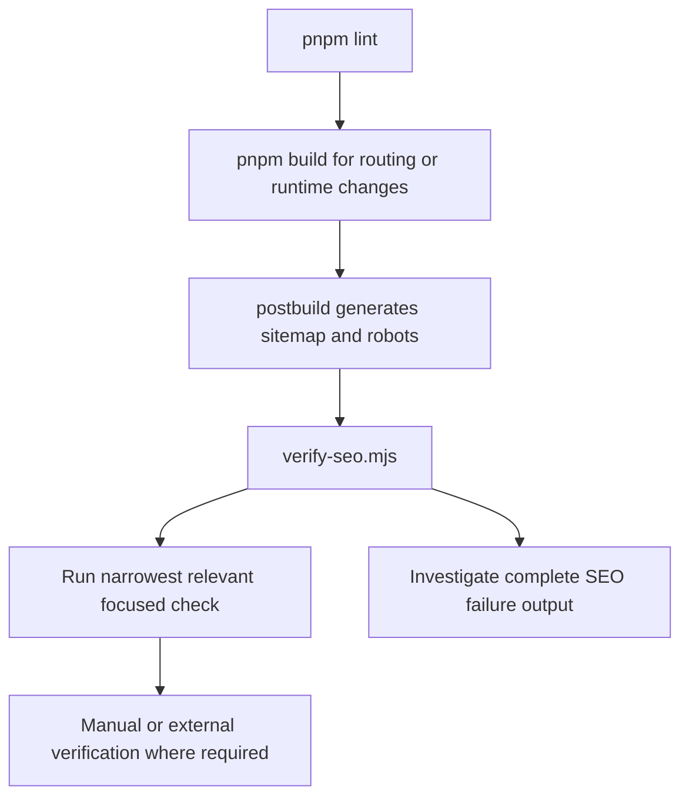
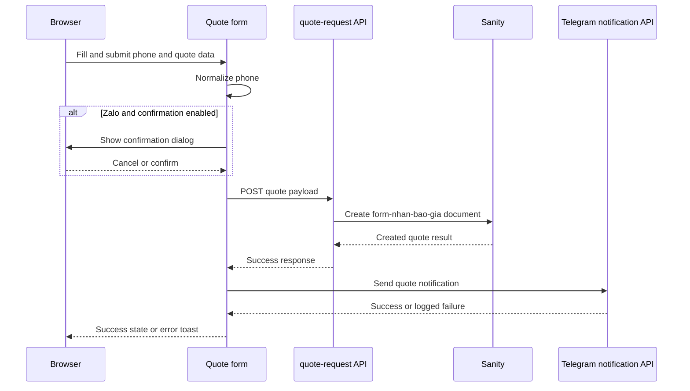

# Testing, Regression, and Safe Change Verification

## What this repository actually tests

The repository's primary verification surface is a set of shell- and browser-oriented regression checks, not a broad unit-test suite. The package scripts expose `pnpm lint`, `pnpm build`, `pnpm regression`, `pnpm regression:lighter`, and `pnpm regression:quote-form`; the separate SEO and configuration validators are script entrypoints rather than package scripts. The Feature 4 test plan describes Jest, Testing Library, and jsdom layers as a future/desired strategy, but explicitly records that the project currently has no Jest setup. Do not report those proposed unit or integration cases as implemented coverage.

For a routing or runtime change, preserve the repository's recommended order:

```bash
pnpm lint
pnpm build
```

Then run the narrowest relevant browser or focused validator. Keep the complete output from every failed command, including browser snapshots, screenshots, and script diagnostics, rather than reducing a failure to a summary line. A green `pnpm build` is not a substitute for lint: the development guidance notes that Next.js is configured to ignore lint failures during production build.



This is the recommended validation order and the build-to-SEO artifact control flow.

## Core commands and their scope

| Command | What it covers | Important limit |
| --- | --- | --- |
| `pnpm lint` | Next.js linting | Must be run explicitly; build success does not prove lint success. |
| `pnpm build` | Production compilation plus the `postbuild` hook | Requires SEO artifact verification to pass after sitemap generation. |
| `pnpm regression` | `scripts/regression-test.sh` against `http://localhost:3000` by default | Requires a running app and `agent-browser`; `basic` checks navigation/content, while `full` or `cart` adds a simplified lighter cart path. |
| `pnpm regression:lighter` | `scripts/test-lighter-builder.sh` | Several checks are labels, screenshots, or stated simulations rather than assertions against browser state. |
| `pnpm regression:quote-form` | `scripts/regression-test-quote-form.sh` | Exercises real submission behavior and therefore creates external side effects. |
| `npx ts-node scripts/validate-tracking.ts` | Static inspection of TypeScript/TSX tracking usage and environment shape | It reports errors, warnings, and informational findings; warnings still exit successfully. The repository does not define a package script for it. |
| `node scripts/verify-seo.mjs` | Existing `public/robots.txt` and `public/sitemap.xml` artifacts | It is an artifact smoke test, not a browser or deployed-HTTP check. |
| `./scripts/validate-ai-config.sh` | `.agents` directories/files and IDE symlink integrity | It must be run from the repository root and exits non-zero for missing or broken required links. |

Start the app with `pnpm dev` before browser scripts, or use a production build followed by `pnpm start` when validating production behavior. The regression scripts create `test-results` screenshots and should be run against an explicitly supplied URL when the target is not local.

## Navigation, product, cart, and checkout regression

`scripts/regression-test.sh [URL] [MODE]` opens the homepage, captures an interactive snapshot, checks the `INUT Design` branding and the main Vietnamese menu labels, then checks `/lighters`, `/products`, and `/blog`. It saves a screenshot after each phase. `MODE=basic` runs those navigation/content phases; `MODE=full` and `MODE=cart` additionally attempt to find a lighter product link (or a quick-add button), open its detail page, click `Thêm vào giỏ`, navigate to `/checkout/lighters`, and look for checkout/cart text. The cart phase is intentionally simplified: it proves that an interactive path can be clicked and that a checkout page is reached, not that persisted cart data, order submission, payment, or analytics payloads are correct.

Use the narrow mode that matches the change. A navigation-only change normally needs `pnpm regression`; a cart or checkout change should add `pnpm regression cart` (or the equivalent script invocation) and a manual check of the cart state and order flow. Preserve the screenshots because the script's visual proof is part of its diagnostic output.

## Quote-request scenarios and side effects

`pnpm regression:quote-form` drives `/contact/form` through focused scenarios:

1. It fills the required fields and checks that an invalid `08683612311` phone is blocked with `Số điện thoại không hợp lệ` and no success toast.
2. It replaces the phone with `0912345678` and expects the normal success toast or success confirmation.
3. It selects `Zalo`, verifies the `Xác nhận gửi qua Zalo` dialog restates the normalized phone, then verifies `Hủy` does not submit.
4. It confirms the Zalo dialog with `Xác nhận gửi` and expects success.
5. It submits `+84 912 345 678` to cover normalization to the local `0` format.
6. It checks that a malformed `9999` value shows the format error without the advisory “not registered on Zalo” hint.

These are not side-effect-free UI tests. Each successful normal submission calls the quote API, which rate-limits requests, validates required fields, and creates a real Sanity `form-nhan-bao-gia` document. The form then sends the created result to `/telegram/send-quote-notification`; Telegram failure is logged but deliberately does not fail the user-facing success flow. The script itself warns that Sanity and Telegram effects cannot be asserted there, so manually verify those systems after a passing run and use test data deliberately. The live Zalo-registration advisory remains network-dependent and is not fully asserted by this script.

The flow under test is therefore:



This shows why a successful browser result does not prove delivery to Sanity or Telegram.

## Lighter builder: useful smoke signal, not full E2E proof

`pnpm regression:lighter` targets `http://localhost:3000/builder/lighters`, takes screenshots, and documents checks for initial layout, upload, 3D model interaction, 2D image positioning, controls, navigation, mobile layout, checkout, and empty-cart state. However, the script explicitly says file upload is simulated because browser file-dialog handling needs special treatment; it does not actually attach the generated PNG. Its `check_element` helper only prints “Checking” text, and the rotation, zoom, drag, mobile viewport, button, checkout, and empty-cart checks are likewise represented largely by labels and screenshots rather than DOM assertions. Treat its “all tests completed successfully” output as a smoke-test transcript and visual checklist, not proof that those states or interactions work.

For builder changes, supplement it with a manual desktop and mobile browser pass: perform a real file selection, verify the thumbnail and metadata, drag the 2D position, rotate/zoom the model, confirm button enabled/disabled transitions, and inspect checkout with both populated and empty cart state. Record the viewport used; the script notes that resizing must happen at browser level and does not itself establish the 44x44px touch-target requirement.

## SEO and tracking verification

The `postbuild` hook runs `next-sitemap --config next-sitemap.config.js && node scripts/verify-seo.mjs`. The sitemap configuration uses `NEXT_PUBLIC_SITE_URL` or `https://inutdesign.com`, excludes `/search`, generates robots rules, and explicitly allows the listed AI crawlers. `verify-seo.mjs` reads generated files from `public/`: it requires robots directives including `Allow: /`, the canonical host and sitemap, and selected disallows; requires sitemap URLs; rejects `/search` and query-parameter URLs; and checks expected home, blog, contact, product, laptop, keyboard-skin, and services URLs. After intentionally adding or removing a route, update sitemap configuration and the verifier's expected URL set together.

For SEO changes, run `pnpm build` so generation and verification happen in sequence, then use browser or deployed checks for HTTP status, response headers, rendered metadata, and structured data. The script alone cannot prove that a deployed host serves the artifact correctly.

`npx ts-node scripts/validate-tracking.ts` recursively scans TypeScript/TSX files while skipping `node_modules`, `.next`, `.git`, and `sanity`. It checks analytics imports, nearby duplicate calls, required parameters for `trackAddToCart`, `trackPurchase`, and `trackViewProduct`, Umami function presence in `analytics.ts`, consent initialization in `_app.tsx`, dataLayer usage, and required entries in `.env.example`; it also warns when `.env.local` is absent. Errors exit 1, warnings exit 0, and the report includes recommendations. Follow warnings rather than treating the exit code as a clean tracking certification. For behavior changes, also inspect GA4/GTM, Umami, consent state, and action-source events in browser DevTools or their respective realtime tools; static scanning cannot prove event delivery or prevent an event from firing on the wrong user action.

## AI configuration validation

`./scripts/validate-ai-config.sh` checks the `.agents` hub directories and global rules, root `.cursorrules` and `.traerules` links, `.github` and `.codex` links, and either whole-directory or per-item `.trae` links. It distinguishes missing directories/files, broken links, valid links, and configuration drift; expected-target mismatches are warnings when the target still exists, while missing or broken required structure sets a non-zero exit code. Run it when changing agent instructions, skills, workflows, or IDE integration rather than as a substitute for application verification.

## Safe-change checklist

- Run `pnpm lint` first.
- Run `pnpm build` for routing, runtime, SEO, or shared configuration changes; inspect `postbuild` output.
- Run the narrowest relevant regression script against a known app instance.
- Use `pnpm regression cart` or `MODE=full` for cart/checkout changes, then manually verify persisted state and order behavior.
- Run `pnpm regression:quote-form` only with awareness that passing submissions write Sanity data and trigger Telegram notifications; clean up or identify test records afterward.
- Treat lighter-builder upload, drag, viewport, and element checks as simulations or manual gaps.
- Run `npx ts-node scripts/validate-tracking.ts` for analytics changes and investigate warnings, not only errors.
- Run `node scripts/verify-seo.mjs` directly when inspecting already-generated artifacts, but prefer `pnpm build` after source/config changes.
- Retain complete failure output, snapshots, screenshots, and the exact URL/mode/environment used.
