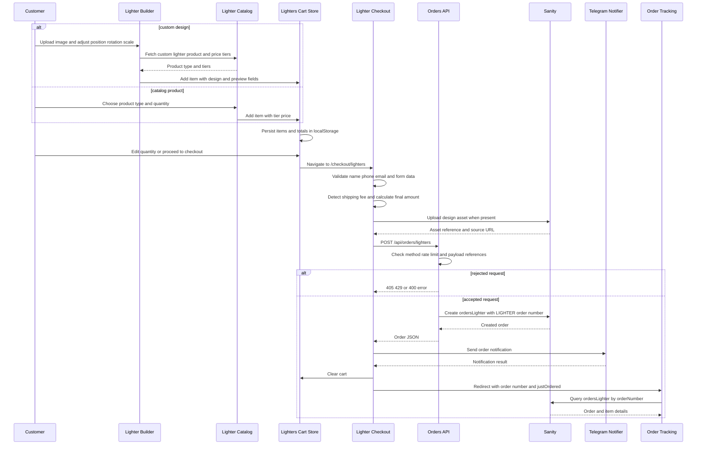
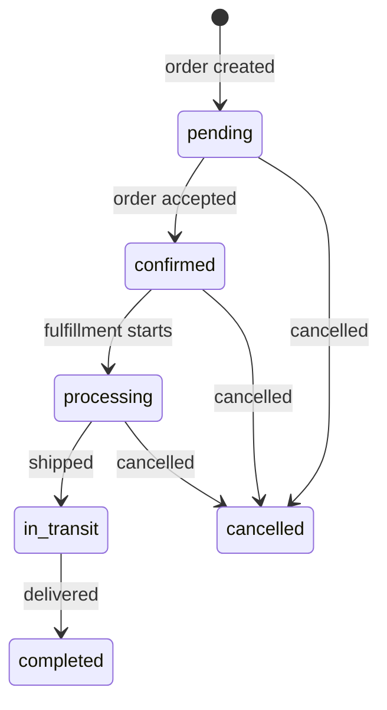

# Lighter Builder, Cart, Checkout, and Order Tracking

This workflow is the lighter-specific commerce path. Customers can add a catalog lighter or create a custom design in the 3D builder, review it in a browser-persisted cart, submit customer and delivery information, and retrieve the resulting order by its generated order number. Sanity is the system of record for the order; the cart is only client-side working state.

## Entry points and route ownership

- Product pages under `/san-pham/lighters` use `AddToLighterCartButton` and the lighter product/type data. A normal add-to-cart operation calculates the initial tier price and adds the item to the lighter store.
- `/builder/lighters` dynamically loads `LighterBuilder` with SSR disabled because it uses Three.js. The builder requires an uploaded image, resolves the custom lighter product, records the design and transform, and redirects to `/cart/lighters`.
- `/cart/lighters` renders `LighterCartContent`. It is the editing boundary for quantity, removal, clearing, and the transition to `/checkout/lighters`.
- `/checkout/lighters` owns form validation, shipping-fee selection, image upload preparation, order submission, analytics, and the success redirect.
- `/order-tracking/lighters/[slug]` uses the route slug as the order number and reads the persisted order through the browser Sanity client.

The route-aware configuration in `utils/cart-routing.ts` is the extension boundary for categories: it maps lighters, laptop skins, keyboard skins, and stickers to category/order metadata and checkout paths. The current dedicated lighter cart implementation is `useLightersCart`; the other route entries are configuration/extension points, not evidence that this page's lighter checkout can accept mixed-category cart items.

## End-to-end sequence



*The sequence shows the normal path plus validation/rate-limit rejection and the persistence/tracking boundary.*

## Builder and cart state

`LighterBuilder` validates that an image exists before continuing. It fetches the product named by `CUSTOM_LIGHTER_NAME`, takes the first price tier as the initial display price, and serializes a user-uploaded file to a base64 data URL when possible. This is deliberate: blob URLs are session-only and do not survive localStorage reloads. A failure to read the file leaves the blob URL as a same-session fallback; a missing product or unexpected error stops the add operation and shows an error.

The builder stores four transform values in `designPreview`: `rot`, `scale`, `x`, and `y`. It also creates `builderPreviewUrl`, a deep link to `/builder/lighters` containing `previewUrl` and those values. Opening that link restores the image immediately, then updates dimensions when the image loads; malformed numeric query values fall back to defaults. This makes the stored design reproducible for an operator or designer rather than merely storing an image.

`useLightersCart` is a Zustand store persisted under the localStorage key `inut-lighters-cart`. It persists `items`, `totalAmount`, and `totalItems`, then recalculates totals during rehydration. Items are keyed for merging by `(productId, lighterTypeId)`: adding an existing combination increases quantity and recalculates its price and subtotal; changing quantity recalculates both again. A quantity at or below zero is removed by the store, while the cart UI limits editable quantities to 1–9999. `subtotal` is always derived as `unitPrice × quantity`, and cart totals are the sum of item subtotals.

Tier pricing uses the highest tier whose quantity is no greater than the requested quantity. Tiers are sorted on a copy in `calculateUnitPrice`, so a quantity of 7 uses the 5-unit tier in the documented example. Missing tiers or non-positive quantities produce zero with a logged error; quantities below the minimum tier use the lowest tier's price. The client therefore recalculates prices as the cart changes, but the API does not independently recalculate or validate monetary values: treat checkout totals as client-supplied order data and preserve that trust boundary when changing pricing.

## Checkout construction and submission

The checkout form requires a name and exactly ten digits for the phone number; email is optional but checked against an email pattern. Address and notes are optional. Shipping fees are fetched through `useShippingFees`, cached by SWR for five minutes, and selected by debounced address detection. Until an address is entered, the `toan-quoc` fee (or first available fee) is the fallback. The checkout currently sets discount to zero and computes:

```text
finalAmount = totalAmount + shippingFee - discount
```

Before the API call, each cart item is converted from local IDs to Sanity references and receives a unique `_key`. If `designImage` exists, checkout fetches it, converts it to a Blob, uploads it through `uploadImageToSanity`, and replaces the source with a Sanity image URL. The item retains `designSourceUrl`, `designPreview`, and `builderPreviewUrl`; when upload succeeds, the preview's `previewUrl` is updated to the durable source URL and the builder deep link is regenerated with the same transform. Upload failure is logged and the order continues without the asset, so operators should not assume an image is present just because a cart item originated in the builder.

The submitted input starts with `status: "pending"` and `paymentStatus: "pending"`, includes COD or bank transfer, and carries item, customer, delivery, and price fields. The submit button is disabled while image preparation or the SWR mutation is running. On success, checkout sends the created order to the Telegram notification hook, tracks the purchase, marks the order complete before clearing the cart, shows success, and redirects to `/order-tracking/lighters/${orderNumber}?justOrdered=1`. The `justOrdered` query flag controls the celebratory header only; it is not an authorization mechanism.

## API, persistence, and failure semantics

`POST /api/orders/lighters` is the only server route in this path. Other methods return 405. A per-request token limiter allows 10 attempts per 60-second interval (up to 1000 unique tokens per interval); a rejected limit returns 429 with a retry-later message. The route then checks for customer name, phone, an array of order items, and for each item a Sanity `_key`, product reference, and lighter-type reference. Missing values return 400. Sanity creation failures are logged server-side and return a generic 500 response.

The server-side Sanity client uses `SANITY_PROJECT_ID`/dataset environment configuration, `SANITY_TOKEN`, `useCdn: false`, and creates a document of type `ordersLighter`. It generates an order number in the form `LIGHTER-YYYYMMDDHHmmssN`, where `N` is a random digit generated by `Math.floor(Math.random() * 11)` (the implementation can therefore produce 10 as well as 0–9). The order date is the caller's supplied date when present, otherwise the server's current ISO timestamp. Sanity schema validation requires an order date, status, at least one item, required product/type references, quantity of at least 1, and non-negative unit price/subtotal/final amount.

Notification is downstream of persistence. Checkout awaits `sendNotification`; if that notification throws, the surrounding submit handler shows the generic checkout error and does not reach the cart-clear/redirect statements even though the Sanity order may already exist. This is an important operational distinction: after a client-visible failure, check Sanity by order number before retrying, because a retry can create a second order. The notification is optional from the server's perspective—the API does not call Telegram—and checkout also has separate abandoned-checkout notifications on unload or route change when a valid phone and non-empty cart exist.

## Order lifecycle and tracking

The Sanity editor exposes these order statuses and initializes new orders to `pending`. Status changes are persisted by the server-side `updateOrderStatus` helper, while payment status is a separate field (`pending`, `paid`, `failed`, or `refunded`). Bank-transfer tracking displays bank information while payment is pending or failed; COD hides the payment-status field in the Sanity editor. `trackingNumber`, admin notes, and customer notes are retained for fulfillment and support.



*The lifecycle is the set of statuses offered by the `ordersLighter` schema; payment status is tracked independently.*

Tracking only fetches when the dynamic slug is a non-empty string. `useOrderByNumber` queries `ordersLighter` by exact `orderNumber` and returns item references expanded with product/type data, design image, transform, source URL, and builder URL. Loading renders a loading state; a failed query or no result renders an error state. A successful page shows order/status/payment information, customer details, optional bank-transfer instructions, item totals, shipping, discount, final amount, and tracking number.

## Safe-change and verification checklist

Focused verification should cover the seams rather than screenshot-only rendering:

1. Exercise `calculateUnitPrice` at below-minimum, exact-tier, between-tier, unsorted-tier, empty-tier, and non-positive quantities; verify subtotal and total recalculation.
2. Test cart persistence and rehydration, merging by product/type, quantity bounds, removal at zero, design fields, and SSR hydration behavior on cart and checkout pages.
3. Test the builder with no image, a file-read failure, missing custom product, query-preview restoration, and preservation of transform values in the generated builder URL.
4. Test checkout validation, shipping fallback/address detection, image-upload success and failure, conversion to Sanity references, duplicate-submit prevention, and redirect only after a created order and notification path.
5. Exercise the API with non-POST, rate-limit exhaustion, missing customer fields, empty or malformed item references, Sanity 500, and a successful creation whose number matches the `LIGHTER-` format.
6. Verify tracking for loading, unknown number/query failure, bank transfer pending/failed, COD, every lifecycle status, design/source/preview fields, and tracking number display.

The relevant implementation boundaries are `components/lighter-builder/LighterBuilder.tsx`, `store/cart/lightersCart.ts`, `utils/priceCalculator.ts`, `pages/checkout/lighters.tsx`, `pages/api/orders/lighters.ts`, `api-client/sanity-server.ts`, `api-client/orders.ts`, `sanity/schemas/ordersLighter.js`, and `pages/order-tracking/lighters/[slug].tsx`.
