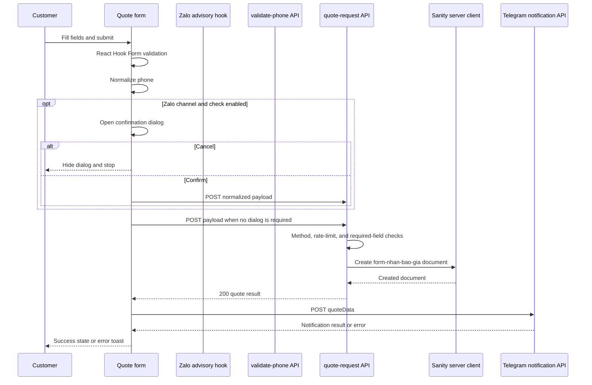

# Quote Request and Contact Workflow

The quote journey is exposed at `/contact/form`, where `pages/contact/form/index.tsx` renders `QuoteRequestFormComponent`. The form owns the user interaction and client validation; `POST /api/quote-request` owns the durable write; and Telegram notification is a separate post-persistence side effect. The success state therefore means that Sanity accepted the quote, not that Telegram delivery succeeded.

## End-to-end control flow



*This sequence shows that the Zalo dialog precedes persistence, while Telegram follows successful persistence and is non-blocking for the customer.*

The phone advisory is not necessarily on the critical submit path. While the phone field changes, `usePhoneZaloCheck` resets its status, normalizes the value, and only schedules a check when the normalized number is a valid Vietnamese mobile number and `isZaloPhoneCheckEnabled()` is true. The debounce is 500 ms. A ref discards a response for an older phone value, preventing stale network results from changing the current field state.

The hook posts `{ phone: normalized }` to `/validate-phone` through `axiosClient`. Axios uses `/api` as its base URL and injects `x-api-key` from `NEXT_PUBLIC_X_API_KEY`; its successful response interceptor unwraps `response.data`. `true`, `false`, and `null` become `registered`, `not_registered`, and `unknown`. The form displays a warning for `not_registered`, but it remains possible to submit.

## Form contract and client behavior

`CreateQuoteRequestInput` defines the payload shape. The client-required fields are:

- `customerName`;
- `phone`;
- `usagePurpose`;
- `receiveQuoteChannel`;
- `designStatus`;
- `quantity` (an integer at least 1).

`email` is required and pattern-checked only when `receiveQuoteChannel` is `email`. `usagePurposeOtherDetail` is required when the purpose is `other`, and `receiveQuoteChannelOtherDetail` is required when the channel is `other`. `urgentDate` is shown and required when `priorityLevel` is `gap`, and it cannot be earlier than today. Company/brand, device model, notes, and the remaining optional values are carried when supplied. Choosing one of the laptop, phone, or keyboard-customization purposes reveals `deviceModel`; changing purpose clears that field.

The page accepts `from` and `note` query parameters: a recognized `from` value preselects `usagePurpose`, while `note` initializes `notes`. Query-bearing pages are marked `noindex` by the page-level SEO configuration.

### Phone normalization invariant

`normalizePhone` removes spaces, hyphens, and parentheses. A number beginning with `+84` becomes a local number by replacing that prefix with `0`; for example, `+84 912 345 678` becomes `0912345678`. `isValidVietnamesePhone` then requires exactly ten digits matching `03`, `05`, `07`, `08`, or `09` as the carrier prefix. The form validates before submit and sends the normalized value in its payload. The server route itself does not repeat this phone-format validation, so the browser validation is the principal format gate for normal use.

## Zalo advisory and dialog semantics

The `/api/validate-phone` route is deliberately non-blocking. It rate-limits by the first `x-forwarded-for` address or socket address, accepts the API key supplied by the Axios client, and probes `https://zalo.me/{encoded phone}` through `checkZaloRegistered`. The probe uses a mobile user agent, manually follows at most five HTTP redirects, rejects non-HTTP(S) redirect targets, and times out each attempt after 10 seconds. A final `zalo.me` host means registered; an Apple App Store host means not registered; anything else is unknown. An unknown result is retried once, then remains `null`.

The route returns HTTP `200` with `zaloRegistered: null` for a rate-limit hit, malformed phone input, and probe failure. This is an intentional compatibility contract: network, Zalo, and advisory rate-limit problems cannot prevent quote submission. Wrong methods return `405` with a nullable result; a bad `x-api-key` returns `401` with a nullable result. Because rate limiting is checked before method and API-key checks, rejected requests also consume the in-memory counter. The shared limiter has a one-minute TTL and its implementation rejects when usage reaches the configured limit, so with a limit of 20 the twentieth counted check is rejected.

When the user selects `zalo`, the feature is enabled, no other dialog is visible, and the form is not already submitting/loading, the submit handler pauses and opens the `YESNO_DIALOG`. It restates the normalized phone and reminds the customer to enable messages from strangers in Zalo. **Confirm** hides the dialog, clears the guard, and calls the normal submit path. **Cancel** hides the dialog, clears the guard, and stops without calling `/api/quote-request`. A dialog creation exception also clears the guard; it does not manufacture a quote submission. If Zalo checking is disabled, the channel is not Zalo, or the advisory status is unknown/not-registered, the normal form submission remains available (the dialog condition depends on channel/configuration, not on a positive registration result).

`isZaloPhoneCheckEnabled()` is enabled for every value except the case-insensitive string `"false"`; an unset `NEXT_PUBLIC_ENABLE_ZALO_PHONE_CHECK` therefore leaves the advisory enabled.

## Quote API and Sanity lifecycle

`quoteRequestApi.create` sends JSON with `POST /api/quote-request`. The route rejects non-POST methods with `405`. It applies its process-local one-minute limiter using `getRequestRateLimitToken(req)` (forwarded address or socket address) with a configured limit of 5; because the limiter rejects at `currentUsage >= limit`, the fifth counted request receives `429` and only the first four are accepted in a fresh window. A rate-limited response is `{ error: "Too many quote requests. Please try again later." }`.

The route then checks the minimal server contract: `customerName`, `phone`, and `usagePurpose` must be truthy. Missing one returns `400` with `Invalid quote request`. It does not perform a complete schema validation of all client-conditional fields, so API callers must honor the same form contract rather than relying on the route to enforce it.

For an accepted request, the route constructs a Sanity document with `_type: "form-nhan-bao-gia"`, sets the editable `createdAt` to the current ISO timestamp, and copies the input fields including company, email, purpose details, quantity, device, delivery channel details, design, priority, urgent date, and notes. It calls the token-bearing `serverClient.create`, returns the created document as JSON with `200`, and never exposes the Sanity write token to the browser. A Sanity or unexpected creation failure is logged server-side and returned as `500` with `Failed to submit quote request.`

The `form-nhan-bao-gia` schema requires customer name (minimum two characters), phone (9–15 characters using digits and common punctuation), usage purpose, and receive-quote channel. Its Studio views hide the purpose/channel detail fields unless their corresponding value is `other`, and hide `urgentDate` unless priority is `gap`. The document is independently ordered by the editable submission time (`createdAt`) or customer name. This editable timestamp should not be confused with Sanity’s system `_createdAt`.

## Telegram side effect and failure boundary

After the quote API succeeds, the form tracks `quote_request`, shows the success toast, and then calls `useTelegramQuoteNotification().sendNotification({ quoteData: result })`. That hook posts to `/api/telegram/send-quote-notification` through Axios. The notification route applies a one-minute process-local limiter with `CACHE_TOKEN` and configured limit 10 (the implementation rejects the tenth counted request, yielding effective acceptance of the first nine in a fresh window), then requires `POST` (`405`) and the matching `x-api-key` (`401`). Missing `quoteData` or any of `customerName`, `phone`, and `usagePurpose` returns `400`; rate exhaustion returns `429`.

The route validates `TELEGRAM_BOT_TOKEN` and `TELEGRAM_CHAT_ID`, constructs a `TelegramClient`, formats the quote with `formatQuoteRequestMessage`, and sends HTML to the configured chat using `sendWithRetry`. `TELEGRAM_MAX_RETRIES` and `TELEGRAM_RETRY_BASE_DELAY` override the defaults of three attempts and 1000 ms. Retry delays use exponential backoff. Configuration errors, exhausted Telegram sends, and unexpected failures return `500`; successful sends return `200` and a Telegram `messageId`.

The formatter maps purpose, receive channel, design status, and priority values to human-readable Vietnamese labels. It includes optional company/email, channel or purpose detail, quantity, device model, design, urgent date, notes, and Vietnam-localized submission time. The notification is operationally useful but not part of persistence: the form catches any notification failure, logs it, and retains the completed success state. It then sets `submitSuccess`, scrolls to the top, resets the form, and offers “Gửi yêu cầu khác”. A failure in Sanity instead produces the generic retry toast and does not enter the success state.

## Focused verification and operational cautions

Run the app first, then use:

```bash
pnpm regression:quote-form
```

or pass a target URL to `./scripts/regression-test-quote-form.sh`. The script opens `/contact/form`, checks the form, verifies an invalid `08683612311` is blocked inline, submits `0912345678`, checks the Zalo dialog and its restated phone, verifies `Hủy` does not submit, verifies `Xác nhận gửi` does submit, covers `+84 912 345 678` normalization, and verifies malformed `9999` shows the format error without the “not registered on Zalo” advisory. It uses `agent-browser`, snapshots, and screenshots in `test-results`.

This regression is not side-effect-free: every successful submit creates a real `form-nhan-bao-gia` Sanity document and attempts a real Telegram notification. The script cannot assert those external effects; manually inspect the intended Sanity dataset and Telegram chat, and use identifiable test data or clean up test records. Zalo status is network-dependent and is not fully asserted by the script.

For changes to this workflow, preserve these invariants:

1. Keep phone normalization consistent between the form, advisory probe, and persisted payload.
2. Keep `/api/validate-phone` nullable and HTTP-200 for advisory failures and rate-limit degradation.
3. Do not turn a Zalo warning or probe failure into a submission gate.
4. Preserve the distinction between dialog cancel (no quote API call) and confirm (normal quote API call).
5. Preserve `405`, `400`, `429`, and `500` behavior at the relevant API boundaries, including the Telegram route’s `401` authentication response.
6. Treat Sanity persistence as the primary success boundary and Telegram as best-effort follow-up.

## Related pages

- [Sanity CMS Integration and Content Contracts](/openwiki/integrations/sanity-cms.md)
- [Telegram Notifications and Zalo Phone Advisory](/openwiki/integrations/telegram-and-zalo.md)
- [Testing, Regression, and Safe Change Verification](/openwiki/testing/regression-and-verification.md)
